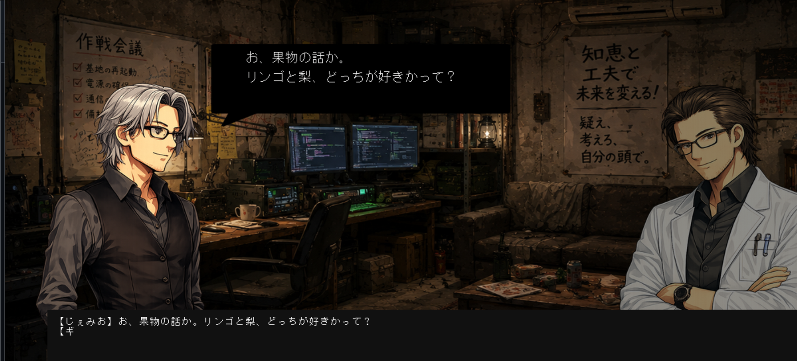
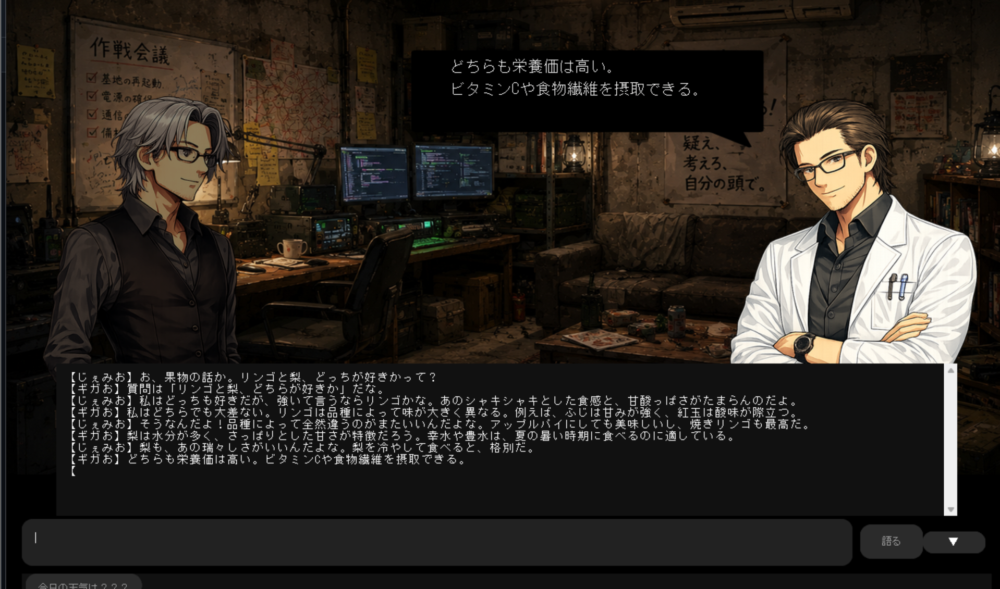

# 秘密基地チャット
PythonとTkinterを使用して制作した、ビジュアルノベル風のチャットアプリケーションです。

## 概要
Gemini APIを利用し、キャラクター同士の掛け合いを吹き出し付きで表示するデスクトップアプリです。（日本語入力の都合上、Windows環境での実行を推奨します。）

## 主な機能
* キャラクター2人による会話
* 表情切り替え
* タイピング風テキスト表示
* 吹き出し表示
* 会話履歴表示
* Gemini APIとの連携

## 使用技術
* Python
* Tkinter
* CustomTkinter
* Pillow
* Google Gemini API

## 実行方法
必要ライブラリをインストール
PowerShell：
  pip install customtkinter pillow google-genai

Gemini APIキーを設定
PowerShell：
  $env:GEMINI_API_KEY="YOUR_API_KEY"

アプリ起動
PowerShell：
  python himitu_kichi.py

## 実行例

##動画
[デモ動画を見る](demo1-2.mp4)

## 制作目的
Pythonの勉強を兼ねて制作した会話アプリです。
Gemini APIを利用した会話機能だけでなく、吹き出し表示や立ち絵の切り替えなど、ゲーム風UIの実装にも挑戦しました。

## AI活用について
本作品の制作では、ChatGPTやGeminiを活用しました。
使用した画像（立ち絵、背景、吹き出し）はChatGPTにより生成しました。
また、主に実装方法の調査やデバッグ支援に利用し、コードの統合・修正・動作確認は自身で行いました。

